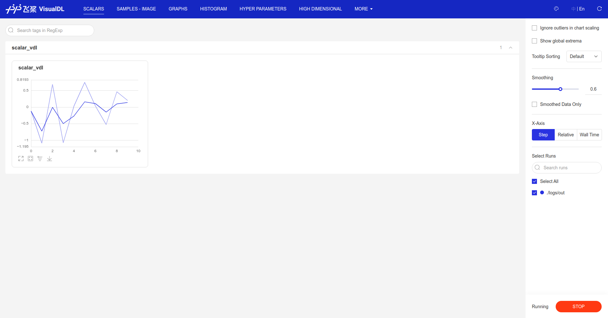
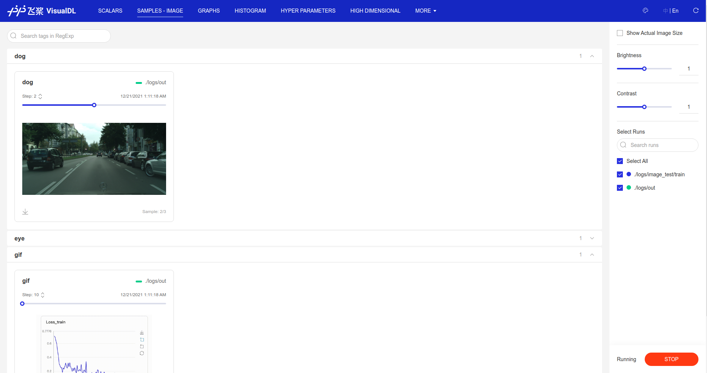
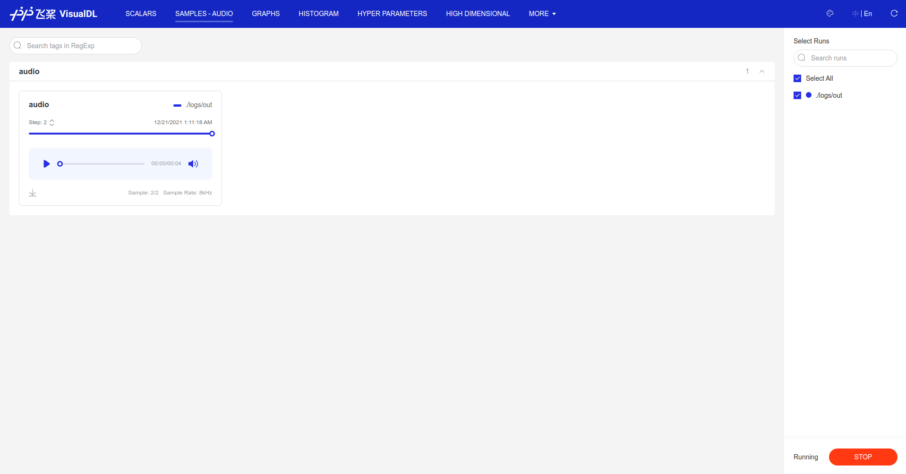
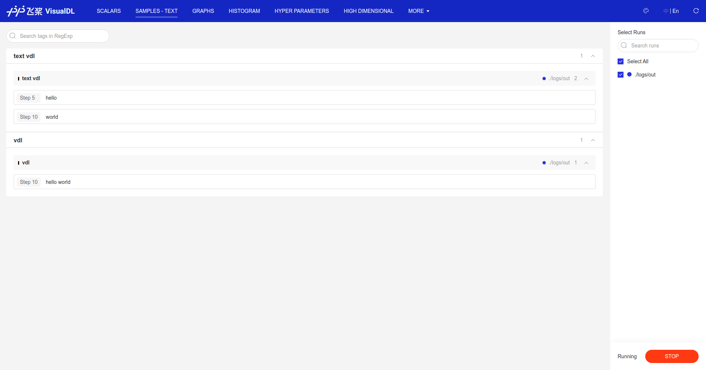
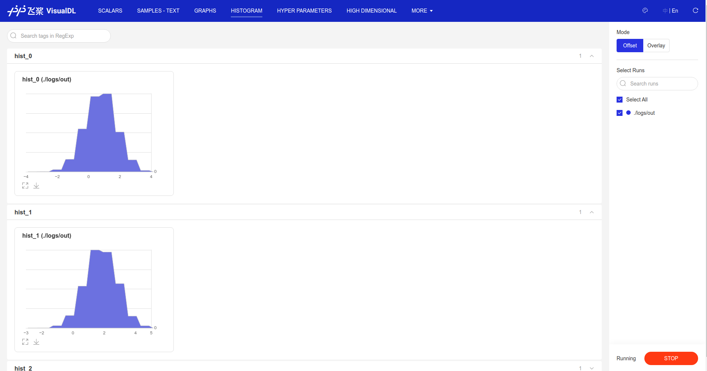
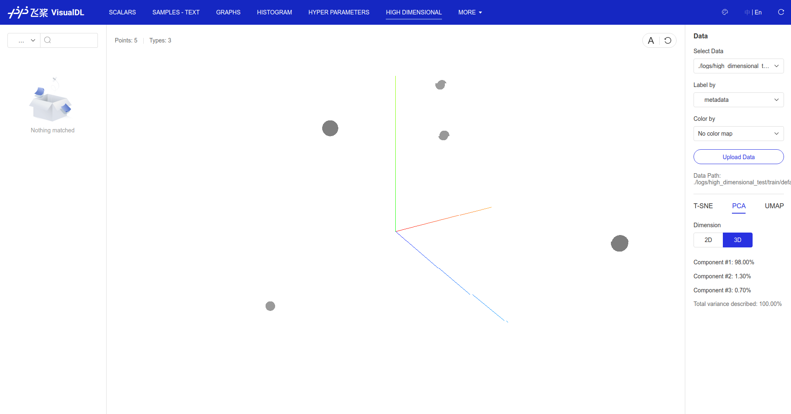
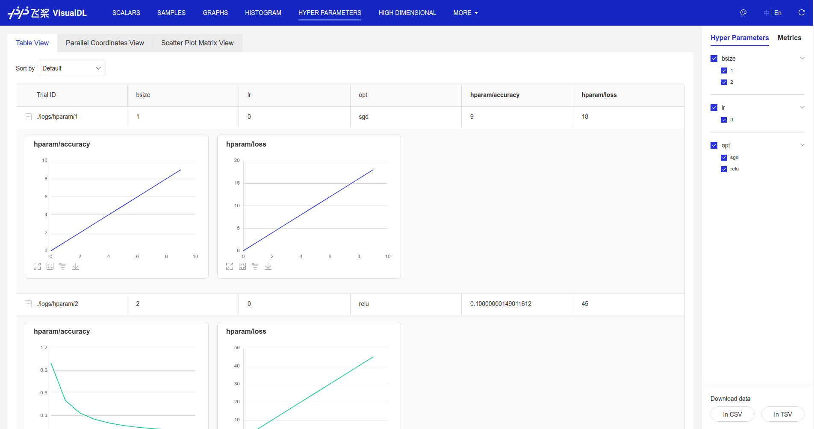
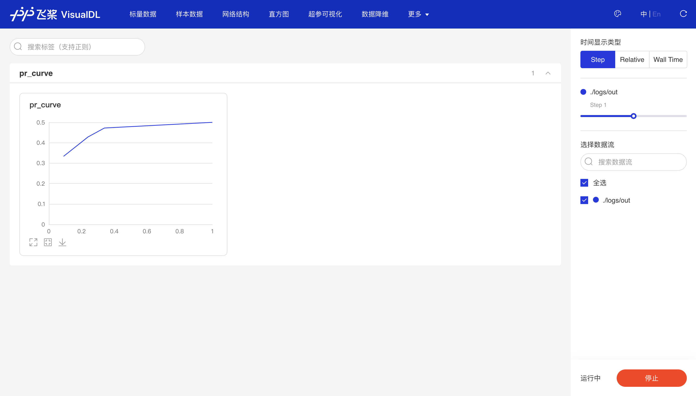
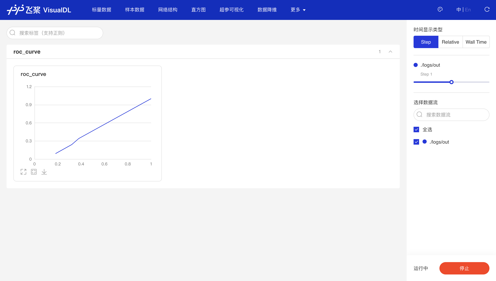

# VisualDL Logger

Standalone C++ API to log data in [VisualDL](https://github.com/PaddlePaddle/VisualDL) format,
without any code dependency on [PaddlePaddle](https://github.com/PaddlePaddle/Paddle) 
or [VisualDL](https://github.com/PaddlePaddle/VisualDL).

<!-- Only support `scalar`, `histogram`, `image`, `audio` `text` and `projector` at the moment. -->
Only support `scalar` at the moment, other plots may be supported later.

```bash
> mkdir build && cd build && cmake .. && cmake --build . -j
> cd .. && mkdir demo && ./visualdl_logger_test
> visualdl --logdir .
```











<!-- todo: screenshots unify and todos -->

# Acknowledgement

- Inspired by and modified from [tensorboard_logger](https://github.com/RustingSword/tensorboard_logger) project.

<!-- - Audio sample from [File Examples](https://file-examples.com/index.php/sample-audio-files/sample-wav-download/). -->
